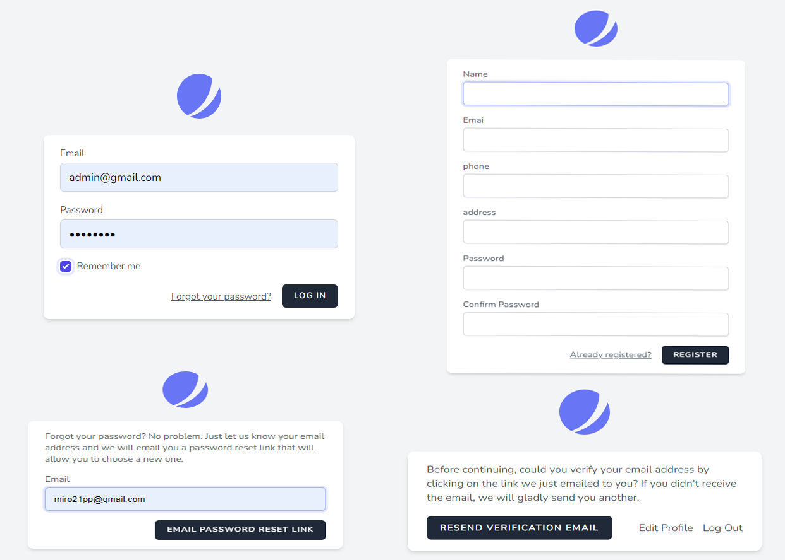
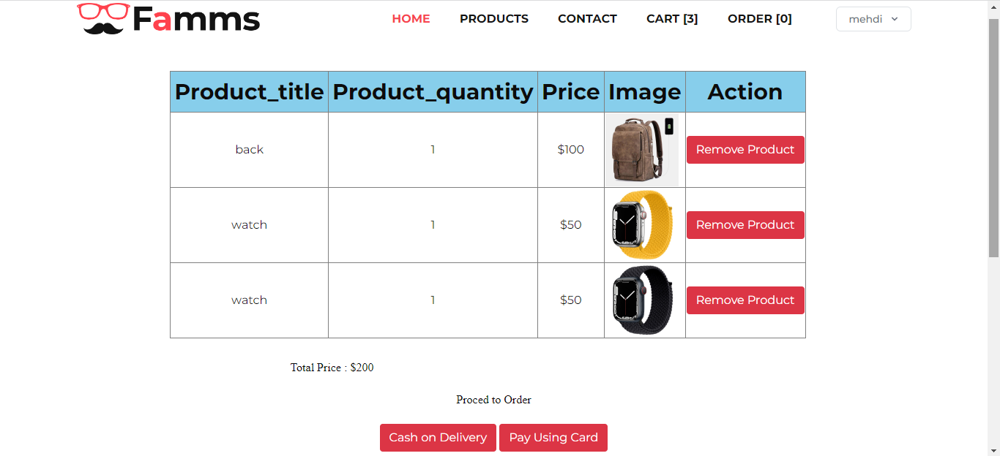
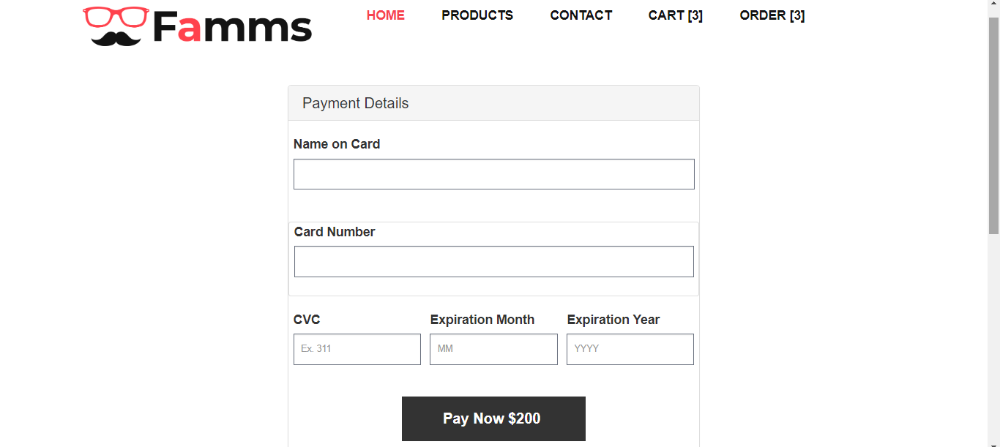
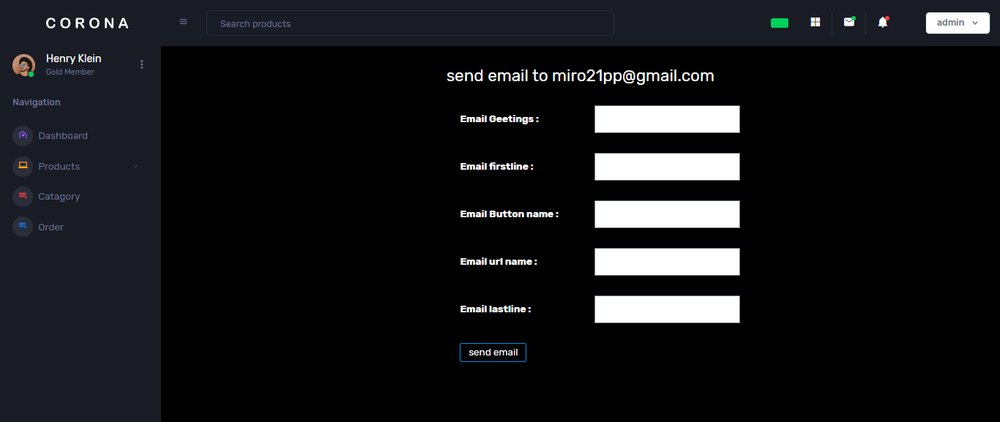

## Home Page :

<atarget="_blank"></a>

## Authentification :

<atarget="_blank"></a>

## Product Page :

<atarget="_blank"></a>

        Product Added to cart :
   

<atarget="_blank"></a>

## Cart :

<atarget="_blank"></a>

## Paiment:

<atarget="_blank"></a>

## Order Page:

<atarget="_blank"></a>

        Cancel Order:
 

<atarget="_blank"></a>

## Admin Dashbord :

<atarget="_blank"></a>

## Admin ADD Product :

<atarget="_blank"></a>

## Admin ALL Product :

<atarget="_blank"></a>

## Admin Order Page :

<atarget="_blank"></a>

## Admin Catagory Page :

<atarget="_blank"></a>

## Admin Send emails :

<atarget="_blank"></a>

